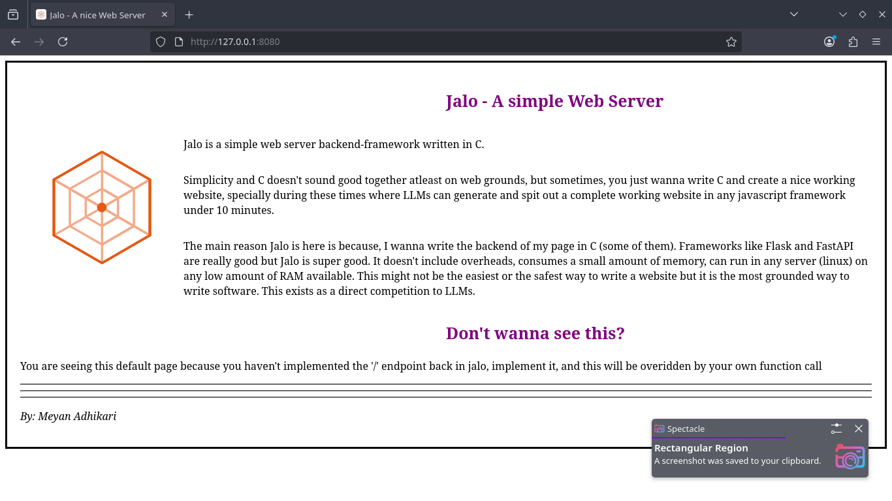

# jalo


A Clua (C + Lua) way of making backend for making websites.

> This is under development. It's not ready for making an actual websites besides testings.
> This is just a personal project, I don't see this being used in actual production.
> Any form of contribution is highly appreciated.

# How it works?
1. You write in C, everything happens in the C environment.
2. You use Lua as a templating language. You can template it inside HTML or even write script outside of it.
3. So, in a way, you can work with both C and Lua. Using one or the other whenever you want. However, I have implemented templating through Lua only till now.

# Walkthrough

## Basic
- Include Jalo's Headerfile, `JaloServe` acts as the main object/struct which will be referenced in almost all function calls. It's a good idea to make it a global variable, then in your main function initialize it using `jalo_init`
    
`main.c`
```c
#include "jalo.h"

JaloServe js;

int main() {
    js = jalo_init();

```
- Just like in other frameworks like Flask and Django, you have to create function calls for each of your endpoints. For example for home or the '/', the function call will look like 

```c
JaloOutput home(HTTP_Request hr) {
    return jalo_render_template(&js, "./assets/test.html");
}
```
- Every endpoint function call should return `JaloOutput` and take input `HTTP_Request` which contains information about the request, including the type, and requested path, etc. 

- `jalo_render_template` renders an html file. If the html file contains Lua (we will see this part later), it also executes the Lua code inside.

- To attach this function call with a path or endpoint you can use the `jalo_register` function. Just below the initialization we can do 

```c
int main() {
    js = jalo_init();

    jalo_register(&js, "/", home);

    jalo_run(&js, 8080);
    jalo_deinit(&js);
}
```
- Here I have registered the '/' endpoint to map `home` which is the function we defined earlier. `jalo_run` should be call at the end which will run the server on a specified port (in this case 8080). Similarly, `jalo_deinit` can be called at the end for cleanups. 

- Notice how every function takes the pointer to the `JaloServe` we created globally as its first argument.

- Endpoints can also be created in a wild-card manner, to accept generic values. For e.g.
```c
JaloOutput assets(HTTP_Request hr) {
    return jalo_file_output(hr.path+1);
}
// in main -->
    jalo_register(&js, "/assets/*", assets);
```
- Notice, in this case the endpoint function returns the same object `JaloOutput` but with a different function - `jalo_file_output`, this will serve any file (just `png` for now, hehe). 

- While registering we have written '/assets/*', this means every endpoint having atleast assets/ in it will be routed to this callback, like /assets/img.png.

- The file name argument is specified as  `hr.path+1`. This is because `hr.path` contains the endpoint. In this case will be `/assets/img.png` but since we want to load `assets/img.png` we added 1, which will point after the '/' that we don't need. (It is just an advantage of C Strings and a cheap way of making a static file feature)

## Lua Templating 
- Your HTML file can be a normal HTML file, and/or also contain some special syntax to allow Jalo to find Lua code inside. For example:

```html
    <p> The time during the time of fetch was:- {{current_time}} </p>
```
- Everything between {{ and }} will be printed out/rendered to final HTML by first rendering it as a lua variable. If you have already specified a variable called `current_time` in your lua script (How to script will be shown later), this will be replaced by the variable. If not an error will be thrown.

- {{ }} can't execute full-lua code though, they are just meant for single variables or something that can be put in an html file like {{user.name}}. ( They just work with strings for now, sorry, haha).

- If you want complex lua code, like loops and statement you can use 

```html
    
        <p>Hello Friend, {{value}}<p>
    

    <hr>

    
        <p> Hello, admin </p>
    
        <p> You are not an admin </p>
    
```
- Here we create a for loop, assuming user.friends is created earlier. Writing a  assumes that whatever written below until the next  will be printed in the html file, here <p>Hello Friend, <name></p> will be printed several times.

- Just like For loop, if statements work the same way and so does almost all of Lua sytanx. This way you can run full lua inside the HTML file. This makes it look like combination of PHP or Flask's Jinja templating.

## Lua Scripting
- Lua Scripts can also be executed outside of these html files in seperate lua script file. A lua script can be something like: 

```lua
user = { 
    name = "Meyan",
    friends = {"Rama", "Ganesha", "Shiva"},
    is_admin = false,
}

current_time = os.date("%H:%M:%S")
```
- This is a complete lua script, that contains variables and tables that we mentioned earlier in the html file. This means that we first have to run this script for Jalo to find them on that HTML file. 
- Notice these are not `local` variables, I haven't designed it to work with that yet. 

- To execute this lua script from Jalo, you can use 
```c
    jalo_execute_file(&js,"./assets/init.lua");
```
You can do this anywhere you want, but I have done this before rendering the homepage. 
```c
JaloOutput home(HTTP_Request hr) {
    jalo_execute_file(&js,"./assets/init.lua");
    return jalo_render_template(&js, "./assets/test.html");
```
- Thus our final C code may look like:
```c
#include "jalo.h"

JaloServe js;

JaloOutput home(HTTP_Request hr) {
    jalo_execute_file(&js,"./assets/init.lua");
    return jalo_render_template(&js, "./assets/test.html");
}

JaloOutput assets(HTTP_Request hr) {
    return jalo_file_output(hr.path+1);
}

int main() {
    js = jalo_init();

    jalo_register(&js, "/", home);
    jalo_register(&js, "/assets/*", assets);

    jalo_run(&js, 8080);
    jalo_deinit(&js);
}
```

# Stuff To Do
- A lot, I won't be working this for more than a month now. So, bye for a month.
- The implemented features might be buggy, haha.

# Contributing
Just send a PR, or file an issue. 

 

